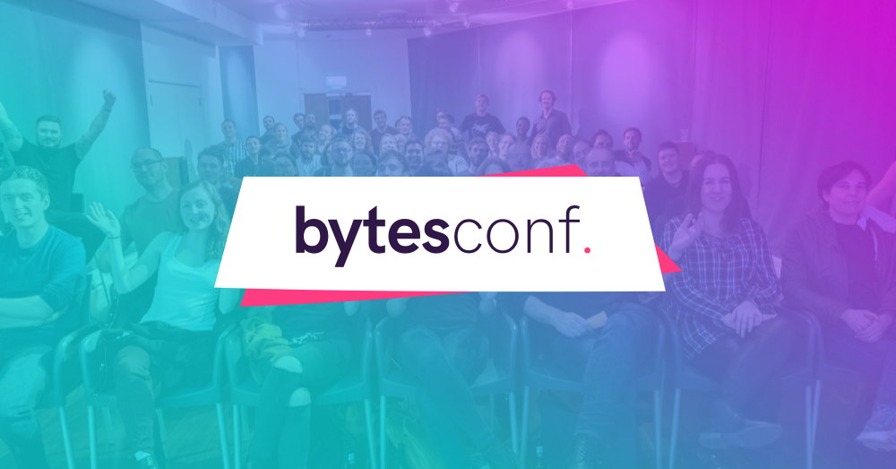

# Bytes

The website for the small Brighton-based conference, [Bytes](https://www.bytesconf.co.uk/). Last run in 2019 this event was an accessible mini-conference talking about all things web.

---

**Note: The local build folders are not used - compiled assets have been committed**. This is because the build process for this site was outdated.
